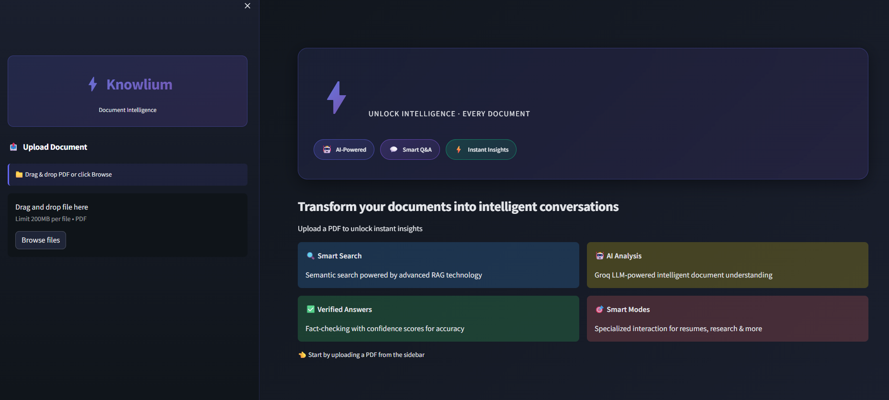
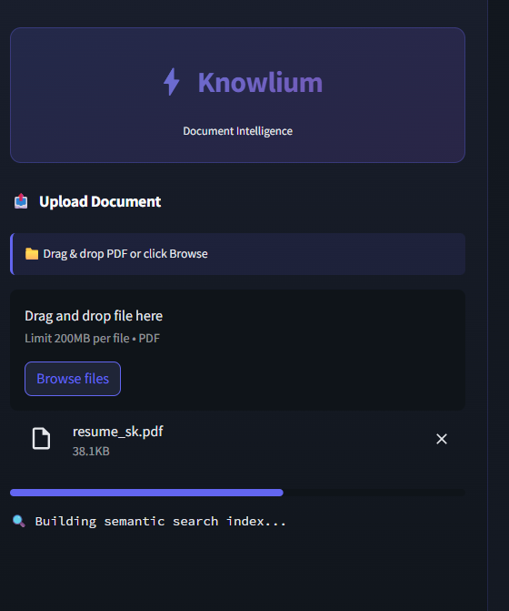
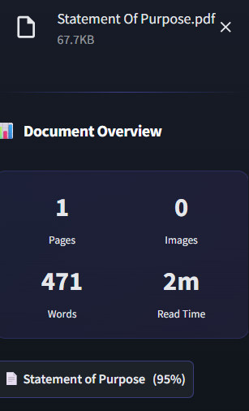
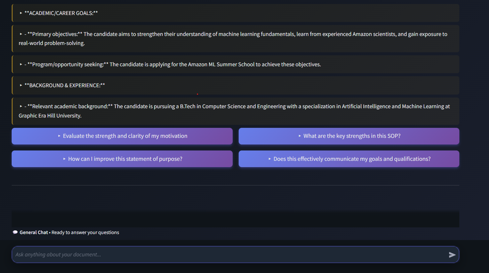
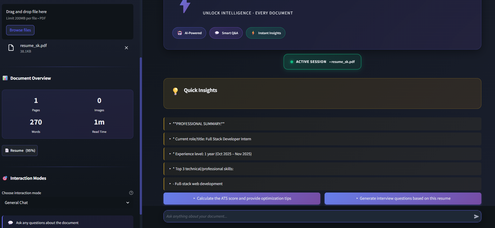
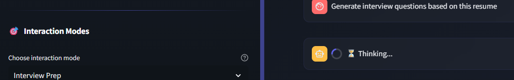
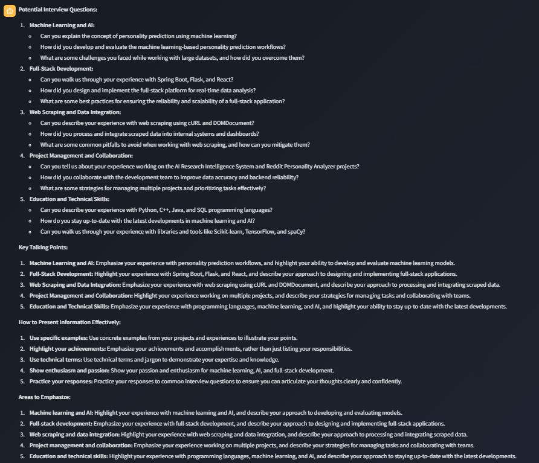

# 🧠 Knowlium - AI-Powered Document Intelligence Platform

An advanced document intelligence platform that enables users to upload PDF documents and interact with them through natural language conversations. Built with cutting-edge AI technologies including RAG, semantic search, FAISS vector databases, and Groq LLMs.


---

## 🎬 Demo

### Home Screen


### Upload Document


### Document Type Detection & Smart Prompts

*Automatically detects document type (Statement of Purpose shown here)*


*Context-aware prompt suggestions based on document type*

### Key Insights Extraction

*Automatic extraction of key points and highlights*

### AI-Powered Q&A

*Natural language conversations with confidence scoring*

### Advanced Features (Resume Analysis)

*Generate personalized interview questions with STAR method answers*

---

## 🚀 Quick Start

```bash
cd Knowlium
pip install -r requirements.txt
streamlit run app.py
```

That's it! Three commands to get started.

---

## ✨ Features

### 🤖 Advanced AI Capabilities
- **RAG (Retrieval-Augmented Generation)**: Accurate, context-aware responses grounded in your documents
- **Semantic Search**: FAISS vector database for intelligent document retrieval
- **Groq LLM Integration**: Fast, powerful language model processing (llama-3.1-8b-instant)
- **Fact Verification**: Automatic confidence scoring and source citations
- **Hallucination Prevention**: All responses backed by document evidence

### 📋 Intelligent Document Classification
Automatically detects and optimizes for **12+ document types**:

- 📄 **Resume/CV** → ATS scoring, interview prep, skills analysis
- 📝 **Cover Letter** → Writing evaluation, improvement suggestions
- 🎓 **Statement of Purpose** → Motivation assessment, goal clarity analysis
- 📚 **Research Paper** → Methodology breakdown, findings summary
- 📖 **Study Material** → Concept explanation, practice questions
- 💼 **Business Report** → Executive summary, insights extraction
- ⚖️ **Legal Document** → Clause analysis, risk identification
- 📊 **Proposal** → Solution analysis, outcome prediction
- 🛠️ **Technical Documentation** → API explanation, implementation guide
- ✍️ **Essay/Article** → Argument analysis, thesis breakdown
- 🎤 **Presentation** → Key points extraction, talking points
- 📄 **General Document** → Smart analysis and summarization

### 🎯 Specialized Features

#### For Job Seekers
- **ATS Score Calculator**: Get 0-100 compatibility score with optimization tips
- **Interview Question Generator**: Personalized questions with STAR method answers
- **Resume Analysis**: Professional insights and improvement suggestions
- **Cover Letter Review**: Evaluate effectiveness and alignment

#### For Students & Researchers
- **Deep Study Mode**: In-depth concept explanations
- **Practice Question Generator**: Create custom questions from material
- **Research Paper Analysis**: Methodology, findings, and conclusions breakdown
- **SOP Evaluation**: Assess motivation and goal clarity

#### For Professionals
- **Document Insights**: Extract patterns, trends, and key findings
- **Executive Summaries**: High-level overviews for busy professionals
- **Technical Deep Dive**: Detailed technical analysis
- **Legal Analysis**: Risk identification and clause breakdown

### 🔒 Security & Quality
- **Prompt Injection Protection**: Advanced detection of malicious inputs
- **Input Validation**: Comprehensive question quality checks
- **Confidence Thresholds**: Customizable accuracy requirements
- **Source Citations**: Transparent evidence for all answers

---

## 📦 Installation

### Prerequisites
- Python 3.8 or higher
- Groq API key ([Get one free here](https://console.groq.com/keys))

### Setup Steps

1. **Clone the repository**
```bash
git clone https://github.com/snehacat/knowlium.git
cd knowlium
```

2. **Create virtual environment (recommended)**
```bash
python -m venv venv
venv\Scripts\activate  # Windows
# source venv/bin/activate  # Mac/Linux
```

3. **Install dependencies**
```bash
pip install -r requirements.txt
```

4. **Configure environment variables**
```bash
copy .env.example .env  # Windows
# cp .env.example .env  # Mac/Linux
```

Edit `.env` and add your Groq API key:
```env
GROQ_API_KEY=your_groq_api_key_here
```

5. **Run the application**
```bash
streamlit run app.py
```

The app will open at `http://localhost:8501`

---

## 📖 Usage Guide

### 1. Upload Document
- Click "Choose PDF" in the sidebar
- Select your PDF file
- Wait for automatic processing (5-15 seconds)

### 2. Review Document Analysis
- View document type classification (with confidence score)
- Check key insights automatically extracted
- Review document statistics (pages, words, read time)

### 3. Ask Questions
- Use context-aware prompt suggestions
- Or type your own questions
- Get AI-powered answers with confidence scores
- View source citations for transparency

### 4. Specialized Features
For resumes:
- **Calculate ATS score** - Get optimization tips
- **Generate interview questions** - STAR method answers included

For other document types:
- Context-specific prompts appear automatically
- Specialized analysis modes available in sidebar

---

## 🛠️ Technologies

### Core Stack
| Technology | Purpose |
|-----------|---------|
| **Streamlit** | Web framework |
| **Groq** | LLM (llama-3.1-8b-instant) |
| **LangChain** | RAG framework |
| **FAISS** | Vector database |
| **HuggingFace** | Embeddings (all-MiniLM-L6-v2) |
| **PyMuPDF** | PDF processing |
| **Tesseract** | OCR (optional) |

### Architecture
```
Upload PDF → Extract Text → Generate Embeddings → Store in FAISS
                ↓
User Question → Semantic Search → Retrieve Context → LLM Generation
                ↓
          Answer with Confidence Score + Citations
```

---

## 📁 Project Structure

```
Knowlium/
├── images/                # Screenshots
├── src/
│   ├── __init__.py       # Package initialization
│   ├── config.py         # UI configuration
│   ├── pdf_processor.py  # PDF extraction & OCR
│   ├── rag_engine.py     # RAG & LLM logic
│   └── utils.py          # Helper functions
├── .streamlit/
│   └── config.toml       # Streamlit config
├── app.py                # Main application
├── .env.example          # Environment template
├── .gitignore
├── requirements.txt
├── LICENSE
└── README.md
```

---

## 🐛 Troubleshooting

### API Key Issues
```bash
# Verify .env file exists and contains:
GROQ_API_KEY=your_actual_key_here

# No spaces, quotes, or extra characters
# Restart app after changes
```

### Low Word Count (Scanned PDFs)
```bash
# Install OCR support:
pip install pytesseract pdf2image
choco install tesseract  # Windows

# OCR activates automatically for low-density PDFs
```

### Import Errors
```bash
pip install --upgrade -r requirements.txt
streamlit cache clear
```

### Port Already in Use
```bash
streamlit run app.py --server.port 8502
```

---

## 🤝 Contributing

Contributions are welcome! Please feel free to submit a Pull Request.

1. Fork the repository
2. Create feature branch (`git checkout -b feature/AmazingFeature`)
3. Commit changes (`git commit -m 'Add AmazingFeature'`)
4. Push to branch (`git push origin feature/AmazingFeature`)
5. Open a Pull Request

---

## 📝 License

This project is licensed under the MIT License - see the [LICENSE](LICENSE) file for details.

---

## 🙏 Acknowledgments

- **Groq** - Fast LLM inference
- **LangChain** - RAG framework
- **HuggingFace** - Embedding models
- **Streamlit** - Web framework
- **FAISS** - Vector similarity search

---

<div align="center">

**Built with ❤️ using AI and Modern Technologies**

[Report Issue](https://github.com/yourusername/knowlium/issues)

**Knowlium © 2024 - AI Document Intelligence**

</div>
